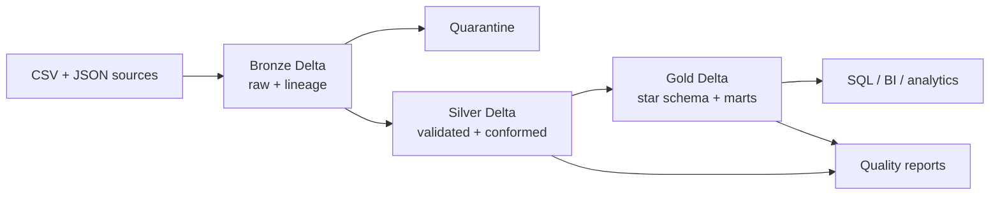

# Retail Medallion Lakehouse

A complete, local-first data engineering portfolio project that turns imperfect
retail source files into governed analytics tables using **Python, PySpark,
Delta Lake and Docker**.

The repository demonstrates batch ingestion, idempotency, lineage, schema
contracts, quarantine handling, SCD Type 2 history, Delta `MERGE`, dimensional
modelling, business aggregations, automated data-quality gates, tests and CI.

## Business problem

An omnichannel retailer receives customer CSV extracts, product JSON snapshots
and order CSV files. Analysts need trustworthy answers about revenue, margin,
customer value, product performance and channel mix. Raw files contain
duplicates and invalid records, so they cannot be queried safely as delivered.

## Architecture



| Layer | Contract |
|---|---|
| Landing | Immutable date-partitioned source delivery |
| Bronze | Source-shaped data plus file, batch, ingestion time and record hash |
| Silver | Typed, deduplicated, validated entities; invalid rows quarantined |
| Gold | Customer/product dimensions, sales fact and decision-ready marts |

## Gold model

```mermaid
erDiagram
  DIM_CUSTOMER ||--o{ FACT_SALES : customer_key
  DIM_PRODUCT ||--o{ FACT_SALES : product_key
  DIM_CUSTOMER {
    long customer_key PK
    string customer_id NK
    string segment
    string city
  }
  DIM_PRODUCT {
    long product_key PK
    string product_id NK
    string category
    decimal unit_cost
  }
  FACT_SALES {
    long sales_key PK
    string order_id NK
    long customer_key FK
    long product_key FK
    date order_date
    decimal net_amount
    decimal margin_amount
  }
```

## Repository structure

```text
config/                 Pipeline paths and quality thresholds
data/landing/           Generated source deliveries (ignored by Git)
data/lakehouse/         Bronze/Silver/Gold Delta tables (ignored by Git)
data/quality/           Machine-readable quality reports
docs/                   Architecture, dictionary and operation guides
scripts/                Windows runner and safe generated-data cleanup
sql/                    Portfolio business questions
src/common/             Configuration, Spark, logging and quality utilities
src/pipelines/          Bronze, Silver and Gold implementations
src/generate_data.py    Deterministic retail source simulator
src/pipeline.py         Command-line orchestration
tests/                  Contracts, configuration and generator tests
```

## Fastest start on Windows

Prerequisites: Docker Desktop with Linux containers and PowerShell.

```powershell
Copy-Item .env.example .env
Set-ExecutionPolicy -Scope Process Bypass
.\scripts\run.ps1
```

The command builds the image, generates a date-partitioned delivery, runs all
three layers and writes quality reports. Generated data remains under `data/`.

Run a particular stage or repeat a historical batch:

```powershell
.\scripts\run.ps1 -Command generate -BatchDate 2026-01-15
.\scripts\run.ps1 -Command run-all -BatchDate 2026-01-15
```

Rerunning the same batch is safe: Bronze identifies records by source file and
content hash; Silver merges business keys; Gold is rebuilt from current
conformed truth.

## Local Python option

Java 17 and Python 3.11 are required.

```bash
python -m venv .venv
source .venv/bin/activate        # Windows: .venv\Scripts\activate
pip install -r requirements.txt
python -m src.pipeline run-all --batch-date 2026-01-15
```

## Commands

| Command | Result |
|---|---|
| `python -m src.pipeline generate` | Produce customers, products and orders |
| `python -m src.pipeline bronze` | Ingest all landing deliveries idempotently |
| `python -m src.pipeline silver` | Validate, deduplicate, conform and quarantine |
| `python -m src.pipeline gold` | Build star schema and business marts |
| `python -m src.pipeline run-all` | Execute the complete dependency order |
| `pytest -q` | Run unit and contract tests |
| `ruff check src tests` | Run static-quality checks |
| `python scripts/clean_generated.py` | Remove generated data only |

## Pipeline logic

### Bronze

- Uses explicit source schemas instead of inference.
- Preserves original values.
- Adds `_source_system`, `_source_file`, `_batch_id`, `_ingested_at`,
  `_ingestion_date`, `_record_hash` and `_bronze_record_id`.
- Delta `MERGE` inserts only unseen file/content identities.
- Partitions by ingestion date.

### Silver

- Standardizes case, whitespace, dates and timestamps.
- Rejects missing keys, malformed email, non-positive quantity, negative price
  and unknown customer/product references.
- Deduplicates using the latest ingestion and deterministic hash tie-break.
- Maintains customer attributes as **SCD Type 2** with `valid_from`,
  `valid_to`, `is_current` and `attribute_hash`.
- Upserts current products and orders with Delta `MERGE`.
- Derives gross amount, discount amount and net amount.
- Writes JSON quality evidence and fails the job when mandatory checks fail.

### Gold

- Generates stable surrogate keys with `xxhash64`.
- Builds `dim_customer`, `dim_product` and partitioned `fact_sales`.
- Calculates cost and gross margin.
- Builds `daily_sales`, `customer_360` and `product_performance`.
- Rebuilds Gold deterministically from Silver to avoid incremental aggregate
  drift in this local portfolio implementation.

## Business outputs

| Table | Grain | Main use |
|---|---|---|
| `gold/dim_customer` | One current customer | Segmentation and geography |
| `gold/dim_product` | One product | Category and unit economics |
| `gold/fact_sales` | One order line/order record | Revenue, discount and margin |
| `gold/daily_sales` | Date × channel | Trend and channel reporting |
| `gold/customer_360` | One customer | Lifetime value and recency |
| `gold/product_performance` | One product | Revenue, margin and category rank |

See [`sql/business_questions.sql`](sql/business_questions.sql) for example
stakeholder queries.

## Quality and observability

- Structured JSON pipeline logs
- Silver and Gold quality reports under `data/quality`
- Mandatory null, uniqueness, positive and non-negative checks
- Quarantine table for invalid source rows
- Deterministic generator and batch date
- GitHub Actions tests, lint and Docker-build validation

## Portfolio demonstration

1. Show the intentionally invalid rows in Landing.
2. Run the pipeline and explain Bronze lineage columns.
3. Show that rerunning the same batch does not duplicate Bronze/Gold facts.
4. Compare Silver customer history with the current Gold dimension.
5. Open the quarantine and quality report.
6. Answer revenue, margin, customer value and product-ranking questions.
7. Explain how this design would move from local files to S3/ADLS and Airflow.

Detailed material:

- [Architecture and flow](docs/ARCHITECTURE.md)
- [Data dictionary](docs/DATA_DICTIONARY.md)
- [Operations and troubleshooting](docs/OPERATIONS.md)
- [Portfolio and interview guide](docs/PORTFOLIO_GUIDE.md)

## Production evolution

This project deliberately runs without paid cloud services. A production
version would replace the local `data` volume with object storage, use a managed
Spark runtime, place orchestration in Airflow/Databricks Workflows/Fabric,
catalog tables in Unity Catalog/Glue/Purview, store secrets in a vault, publish
metrics to an observability platform and apply retention/VACUUM policies.
