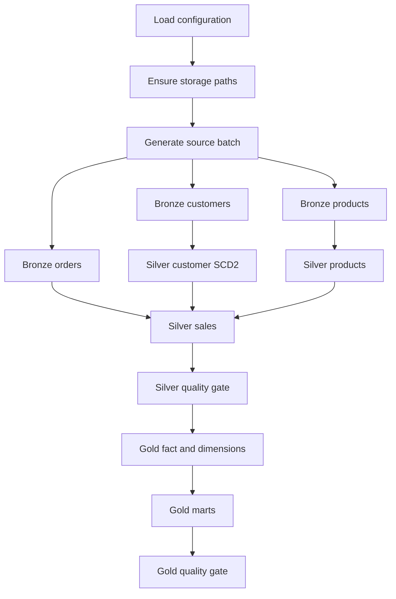

# Architecture and execution flow

## Design decisions

1. **Delta Lake rather than plain Parquet** supports ACID transactions, merge
   semantics, schema enforcement and auditable versions.
2. **Postponed cloud coupling** keeps the project runnable on any laptop. Paths
   are centralized so local storage can later become S3, ADLS or GCS.
3. **Explicit schemas at ingestion** expose contract drift immediately.
4. **Bronze is immutable in meaning**: no business cleaning occurs there.
5. **Silver owns trust**: data types, keys, foreign references, deduplication,
   quarantine and SCD2 history.
6. **Gold owns consumption**: grains and measures are defined for analysts.
7. **Idempotency at every layer** makes retries safe.

## Orchestration graph

`src/pipeline.py` is a dependency-aware command runner. In a production
orchestrator each node would become a separately retryable task with the same
inputs and outputs.

## Incremental and replay behavior

- Landing partitions identify source delivery date.
- Bronze scans deliveries but merges `_bronze_record_id`; a replay inserts no
  second copy of an unchanged row.
- Silver selects the latest raw representation per business key.
- Customer attribute hash changes expire the current row and append a new
  SCD2 version.
- Products and orders merge by natural key.
- Gold overwrite is intentional: local data volume is modest and rebuilding
  avoids partially updated aggregates. Production could use changed partitions.

## Failure boundaries

| Failure | Behavior |
|---|---|
| Source syntax/contract mismatch | Explicit schema produces nulls; Silver validation quarantines/rejects |
| Duplicate delivery | Bronze merge ignores existing record identity |
| Invalid business values | Silver quarantine and count |
| Unknown foreign key | Order is not promoted to trusted sales |
| Mandatory quality failure | JSON evidence is written and stage raises an error |
| Gold rerun | Tables are deterministically rebuilt from Silver |

## Security and governance evolution

Local generated data contains no real customer information. In production:

- encrypt object storage and transport;
- tokenize/hash customer PII in Silver;
- restrict Bronze PII to engineering roles;
- expose governed Gold views to analysts;
- record dataset ownership, classification and lineage in a catalogue;
- configure retention and deletion for privacy law;
- keep secrets outside images and Git.
